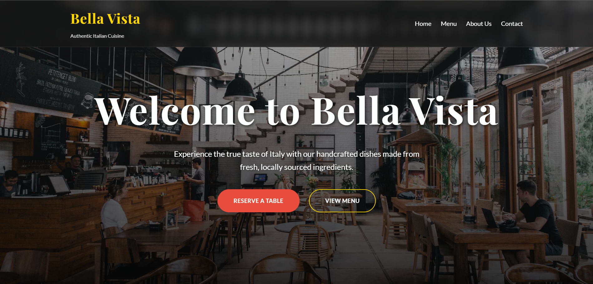

# BellaVista-Mern_project001
This is a project from my course with slight improvements and twigs , hope you will like it 
# Bella Vista - A Modern & Mesmerizing Restaurant Website 🍝✨

 Welcome to the repository for Bella Vista, a fully responsive, single-page concept website for an upscale Italian restaurant. This project was built from the ground up with a focus on modern UI/UX principles, elegant animations, and a cohesive, mesmerizing theme.

**You can visit the Website:** [Live Demo](https://soumya-bella-vista.netlify.app/) ---

## 🌟 Key Features

* **Fully Responsive Design:** Adapts beautifully to all devices, from large desktop monitors to mobile phones.
* **Single-Page Architecture:** A smooth, seamless user experience with scroll-to-section navigation.
* **"Frosted Glass" UI (Glassmorphism):** Modern, layered UI elements used in the header, menu, and forms to create a sense of depth and elegance.
* **Dynamic Scroll-Triggered Animations:** Content gracefully fades and slides into view as the user scrolls, implemented efficiently with the Intersection Observer API.
* **CSS-Only Mobile Navigation:** A sleek, animated hamburger menu provides a great mobile experience without relying on JavaScript.
* **Interactive UI Elements:** Subtle hover effects, crystal-shine animations, and a mesmerizing pulse glow on social icons create an engaging user journey.
* **Functional Forms:** Clean and user-friendly forms for both reservations and general contact.

---

## 🎨 Design & Technical Highlights 

This project is more than just a static webpage; it's a demonstration of modern front-end techniques and a thoughtful approach to design and performance.

### 1. **Modern CSS & Scalable Theming**
The entire site's theme—colors, fonts, etc.—is controlled by **CSS Custom Properties (Variables)** defined in the `:root`. This makes the theme easily maintainable and scalable. An interviewer will appreciate this as it demonstrates an understanding of writing clean, production-ready CSS.

```css
:root {
    --font-primary: 'Playfair Display', serif;
    --primary-color: #E74C3C;
    --gold-accent: #FFD700;
    /* ... and so on */
}
```

### 2. **Performance-Optimized Scroll Animations**
Instead of using inefficient scroll event listeners, all on-scroll animations are triggered using the **`Intersection Observer API`**. This is a modern, highly performant method that doesn't bog down the main browser thread, ensuring a smooth scrolling experience even with many animations. This highlights knowledge of modern browser APIs and performance best practices.

### 3. **Advanced CSS for Fluid Layouts**
The layout heavily utilizes **CSS Grid** with `repeat(auto-fit, minmax(value, 1fr))`. This creates a robust and intrinsically responsive grid for sections like the menu, which adapts the number of columns based on available space without needing excessive media queries. **Flexbox** is used for fine-tuned alignment within components. This showcases a strong grasp of modern CSS layout modules.

### 4. **Emphasis on Accessibility (A11y)**
Care was taken to ensure the site is accessible:
* Use of **semantic HTML tags** (`<header>`, `<footer>`, `<section>`, `<nav>`) provides structure for screen readers.
* Interactive elements like social media icons have `aria-label` attributes for context.
* Color contrasts were chosen to be readable.
* Form inputs are associated with `<label>`s where appropriate.

---

## 🛠️ Technologies Used

* **HTML5:** Semantic and accessible markup.
* **CSS3:** Custom Properties, Grid, Flexbox, Keyframe Animations, Transitions, and `backdrop-filter` for the glass effect.
* **JavaScript (ES6+):** Used exclusively for the performance-optimized Intersection Observer to trigger animations.
* **Google Fonts:** For elegant typography ('Playfair Display' & 'Lato').
* **Font Awesome:** For clean, scalable icons.

---

## 🚀 Setup and Installation

This is a static front-end project. No complex build steps are required.

1.  **Clone the repository:**
    ```bash
    git clone [https://github.com/soumya964/BellaVista-Mern_project001.git](https://github.com/soumya964/BellaVista-Mern_project001.git)
    ```

2.  **Navigate to the project directory:**
    ```bash
    cd your-repo-name
    ```

3.  **Open `index.html` in your browser:**
    Simply open the `index.html` file, and you're good to go!

---

## 📸 Screenshots

**Desktop View**


**Mobile View**


---

## 👤 Author

**K.Soumya Ranjan Das**
* GitHub: [@soumya964](https://github.com/soumya964)
* LinkedIn: [Comming Soon]
* Gmail: soumya292ranjan@gmail.com

Feel free to reach out with any questions or feedback!
